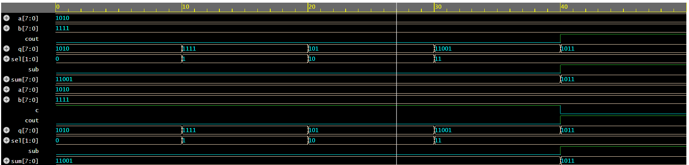

# 4-bit ALU in Verilog

##  Overview
This project implements a 4-bit Arithmetic Logic Unit (ALU) using Verilog.  
It performs basic arithmetic and logical operations and is verified using a testbench and waveform analysis.

---

##  Features
- 4-bit inputs: A, B
- Operations supported:
  - AND
  - OR
  - XOR
  - ADD
  - SUBTRACT (using 2’s complement)
- Carry output (cout)
- Result output (q)

---

##  Design Concept

###  Subtraction using XOR
Subtraction is implemented using:
- B ^ sub
- cin = sub

This allows:
- sub = 0 → Addition
- sub = 1 → Subtraction

---

##  Module Structure
- ALU1 → 1-bit ALU
- ALU4 → 4-bit ALU using 4 instances of ALU1

---

##  Testbench
- Inputs are applied using different sel and sub values
- Outputs monitored using $monitor
- Waveforms generated using $dumpfile and $dumpvars

---

##  Waveform

---

##  How to Run
You can simulate using:
- Icarus Verilog (EDA Playground)

Steps:
1. Compile design + testbench
2. Run simulation
3. View waveform using EPWave

---

##  Files
- design.sv → ALU design
- testbench.sv → Testbench
- waveform.png → Simulation waveform

---

##  Future Improvements
- Add more operations (shift, compare)
- Add flags (zero, overflow)
- Design 8-bit or 16-bit ALU

---

##  Author
Adesh Shukla
